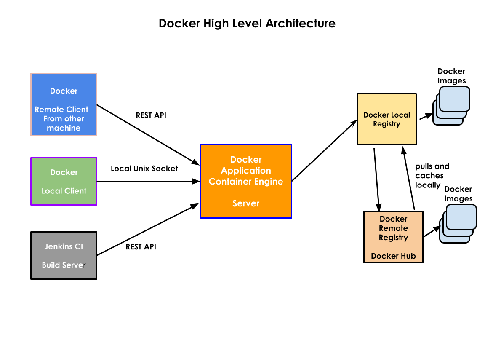

# High Availability (HA)
- is difficult or expensive in case of Monothilic applications
- they are cheaper in case of Microservice applications

# Monolithic application
- Traditional application generally follow this architecture
- 3 tier applications
    - Frontend layer
    - Business layer
    - DB Layer
- Scale up/down
   is expensive
- several components
  Web Server / App Server
     - Server 1
     - Monolithic application is deployed here
  DB Server
     - Server 2
  Message Queue
     - Server 3


# RDBMS
- supports ACID Properties by default

# NoSQL Databases
- they don't support ACID property

# Microservice Overview
- self-contained, independent application that solves/focuses one functionality
- distributed computed
- NoSQL DBs
  - Mongo DB
  - CouchBase 


# Virtualization
- is called as Hypevisor
- with this we can run many Operating Systems side by side on the same Desktop/Laptop/Workstation/Server
- VMWare
    - workstation ( Windows, Linux & Mac )
    - Fusion ( Mac)
    - vSpehere (v-center) - Bare Metal Hypervisor
- heavy weight virtualization
    - each virtual machine( Guest OS) requires dedicated hardware resources
       - they need dedicated CPU, RAM and storage

# Docker Overview
- a container technology
- developed by Docker Inc organization
- comes in two flavour
   - Community Edition ( opensource )
   - Enterprise Edition (Paid)
- an application virtualization technology
- container is not a OS
- containers are nothing but application process that runs in a separe namespace(virtual sandbox environment)
- container is not a virtual machine
- within a Virtual Machine, we can install Docker or similar container tools 

# Orchestration Platform Overview
- container management platform
- examples
  - Docker SWARM ( supports only Dockerized based applications )
  - Google Kubernetes ( opensource )
  - RedHat OpenShift

- features offered
   - inbuilt application monitoring
   - High Availability
   - self healing
   - Scaling up/down
   - rolling update
       - upgrating your live application from one version to other without downtime
   - load balancing
   - service discovery
- Operators
   - You have ready-made or you can create custom operators that can create a cluster of DB Servers that can synchronize data

## Docker High-level architecture


## Docker Image Layers


RedHat OpenShift
- RedHat's distribution of Kubernetes with many additional features
- is not just an orchestration platform
- it also supports CI/CD
- TekTon serverless CI/CD (Continuous Integration/Continuous Delivery/Continuous Deployment) pipeline
- kube-virt you can also scale up/down additional nodes(servers - virtual machine)


Microservice
 - NodeJS application with Postgres Database
 - one pod that runs NodeJS application
 - another pod that runs Postgres Database
 - put togeteher nodejs Pod ( NodeJS appl)  + Postgres Pod (DB) => Single Microservice ( multi-pod microservice )


# Agile
  - a concept , a way of working which helps you get frequent feedback from customer
  - SCRUM/Kanban/XP is an Agile Framework
  - alternate to waterfall framework
  - fail-fast software development approach that helps us in getting frequent feedback from customer

# DevOps
- automated process to build, test and release the product to customer with confidence
- Organization that follow SCRUM or any Agile Framework like Kanban will follow DevOps as their engineering practice
- DevOps Tools
  Version Control Softwares ( Source Control)
    - Git/GitHub
    - Perforce
    - Clear Case
  Build tools
    - Make
    - Ant, Maven/Gradle
  Containerization
    - Docker
    - Podman
  Orchestration Platforms
    - Google Kubernetes
    - RedHat OpenShift
    - Docker Sward
  CI/CD Servers
    - Jenkins
    - Bamboo
    - TeamCity
    - Microsoft TFS(TEam Foundation Server)
    
    
# Hypervisor
- refers to Virtualization technology
- Vendor specific Hypervisor tools
  Redhat
    - kvm (Kernel Virtual Machine) - Type 2
    - free for personal & commercial use
    - extremely efficient in terms of Performace as it is tightly integrated with Kernel
  VMWare
     - vSphere - Commercial Product ( Type 1 )
     - Workstation (Linux,Windows & Mac) - Commercial Product (Type 2 )
     - Fusion(Mac) - Paid software (Type 2)
  Microsoft
     - Hyper-V ( Microsoft Windows Pro 10 & all latest Server grade OS )
  Oracle
     - VirtualBox ( Free, works in Windows, Linux and Mac )
  Parallels(Mac)
     - Paid software
- comes in two flavors
  1. Type 1 (Bare Metal Hypervisors - Used in Servers/Workstations )
  2. Type 2 (Used in Laptops/Desktops/Workstations )


## Containers
- application process
- one application per container is the recommended practice
- typically also supports shell prompt ( bash or sh, etc )
- each container get's an IP address 
- each container has a file system
- each container has a separate copy of Network Stack ( 7 OSI Layers )
    - hence every container has a software defined network card
- doesn't have its own OS kernel as it is not an Operating System

Different Linux OS Distributions and Package Managers supports
- Ubuntu Linux Distribution
    - it supports a package manager called apt(apt-get)
-  RedHat CentOS/RHEL Linux Distribution
    - it supports a package manager called yum or rpm

# Container Image
- is a blueprint of a container
- using a single Container Image, one can create any number of containers
- software tools can be installed in an Image, when containers are created it will
  have all the software that are pre-installed in the image
- this is similar to VMWare image or iso 
- except that it is not a OS image
- has some package manager
  - helps in installing/uninstalling/upgrading software within a Linux distribution

# Container
- is an running instance of the Container Image
- get's it own IP address, shell, package manager and file system
- typically has the application and its dependent libraries


# Installing Docker

For detailed instructions, please refer https://docs.docker.com/engine/install/centos/

```
sudo yum install -y yum-utils
sudo yum-config-manager --add-repo https://download.docker.com/linux/centos/docker-ce.repo
sudo yum install docker-ce docker-ce-cli containerd.io docker-compose-plugin
```

Expected output
<pre>
[jegan@tektutor ~]$ docker --version
bash: docker: command not found...
[jegan@tektutor ~]$ sudo yum install -y yum-utils
[sudo] password for jegan: 
Loaded plugins: fastestmirror, langpacks
Loading mirror speeds from cached hostfile
 * base: mirrors.nxtgen.com
 * extras: mirrors.nxtgen.com
 * updates: mirrors.nxtgen.com
Package yum-utils-1.1.31-54.el7_8.noarch already installed and latest version
Nothing to do
[jegan@tektutor ~]$ sudo yum-config-manager --add-repo https://download.docker.com/linux/centos/docker-ce.repo
Loaded plugins: fastestmirror, langpacks
adding repo from: https://download.docker.com/linux/centos/docker-ce.repo
grabbing file https://download.docker.com/linux/centos/docker-ce.repo to /etc/yum.repos.d/docker-ce.repo
repo saved to /etc/yum.repos.d/docker-ce.repo
[jegan@tektutor ~]$ sudo yum install docker-ce docker-ce-cli containerd.io docker-compose-plugin
Loaded plugins: fastestmirror, langpacks
Loading mirror speeds from cached hostfile
 * base: mirrors.nxtgen.com
 * extras: mirrors.nxtgen.com
 * updates: mirrors.nxtgen.com
docker-ce-stable                                                              | 3.5 kB  00:00:00     
(1/2): docker-ce-stable/7/x86_64/updateinfo                                   |   55 B  00:00:00     
(2/2): docker-ce-stable/7/x86_64/primary_db                                   |  80 kB  00:00:00     
Resolving Dependencies
--> Running transaction check
---> Package containerd.io.x86_64 0:1.6.7-3.1.el7 will be installed
--> Processing Dependency: container-selinux >= 2:2.74 for package: containerd.io-1.6.7-3.1.el7.x86_64
---> Package docker-ce.x86_64 3:20.10.17-3.el7 will be installed
--> Processing Dependency: docker-ce-rootless-extras for package: 3:docker-ce-20.10.17-3.el7.x86_64
---> Package docker-ce-cli.x86_64 1:20.10.17-3.el7 will be installed
--> Processing Dependency: docker-scan-plugin(x86-64) for package: 1:docker-ce-cli-20.10.17-3.el7.x86_64
---> Package docker-compose-plugin.x86_64 0:2.6.0-3.el7 will be installed
--> Running transaction check
---> Package container-selinux.noarch 2:2.119.2-1.911c772.el7_8 will be installed
---> Package docker-ce-rootless-extras.x86_64 0:20.10.17-3.el7 will be installed
--> Processing Dependency: fuse-overlayfs >= 0.7 for package: docker-ce-rootless-extras-20.10.17-3.el7.x86_64
--> Processing Dependency: slirp4netns >= 0.4 for package: docker-ce-rootless-extras-20.10.17-3.el7.x86_64
---> Package docker-scan-plugin.x86_64 0:0.17.0-3.el7 will be installed
--> Running transaction check
---> Package fuse-overlayfs.x86_64 0:0.7.2-6.el7_8 will be installed
--> Processing Dependency: libfuse3.so.3(FUSE_3.2)(64bit) for package: fuse-overlayfs-0.7.2-6.el7_8.x86_64
--> Processing Dependency: libfuse3.so.3(FUSE_3.0)(64bit) for package: fuse-overlayfs-0.7.2-6.el7_8.x86_64
--> Processing Dependency: libfuse3.so.3()(64bit) for package: fuse-overlayfs-0.7.2-6.el7_8.x86_64
---> Package slirp4netns.x86_64 0:0.4.3-4.el7_8 will be installed
--> Running transaction check
---> Package fuse3-libs.x86_64 0:3.6.1-4.el7 will be installed
--> Finished Dependency Resolution

Dependencies Resolved

=====================================================================================================
 Package                       Arch       Version                         Repository            Size
=====================================================================================================
Installing:
 containerd.io                 x86_64     1.6.7-3.1.el7                   docker-ce-stable      33 M
 docker-ce                     x86_64     3:20.10.17-3.el7                docker-ce-stable      22 M
 docker-ce-cli                 x86_64     1:20.10.17-3.el7                docker-ce-stable      29 M
 docker-compose-plugin         x86_64     2.6.0-3.el7                     docker-ce-stable     7.0 M
Installing for dependencies:
 container-selinux             noarch     2:2.119.2-1.911c772.el7_8       extras                40 k
 docker-ce-rootless-extras     x86_64     20.10.17-3.el7                  docker-ce-stable     8.2 M
 docker-scan-plugin            x86_64     0.17.0-3.el7                    docker-ce-stable     3.7 M
 fuse-overlayfs                x86_64     0.7.2-6.el7_8                   extras                54 k
 fuse3-libs                    x86_64     3.6.1-4.el7                     extras                82 k
 slirp4netns                   x86_64     0.4.3-4.el7_8                   extras                81 k

Transaction Summary
=====================================================================================================
Install  4 Packages (+6 Dependent packages)

Total download size: 104 M
Installed size: 419 M
Is this ok [y/d/N]: y
Downloading packages:
warning: /var/cache/yum/x86_64/7/extras/packages/container-selinux-2.119.2-1.911c772.el7_8.noarch.rpm: Header V3 RSA/SHA256 Signature, key ID f4a80eb5: NOKEY
Public key for container-selinux-2.119.2-1.911c772.el7_8.noarch.rpm is not installed
(1/10): container-selinux-2.119.2-1.911c772.el7_8.noarch.rpm                  |  40 kB  00:00:00     
warning: /var/cache/yum/x86_64/7/docker-ce-stable/packages/docker-ce-20.10.17-3.el7.x86_64.rpm: Header V4 RSA/SHA512 Signature, key ID 621e9f35: NOKEY
Public key for docker-ce-20.10.17-3.el7.x86_64.rpm is not installed
(2/10): docker-ce-20.10.17-3.el7.x86_64.rpm                                                       |  22 MB  00:00:04     
(3/10): docker-ce-cli-20.10.17-3.el7.x86_64.rpm                                                   |  29 MB  00:00:04     
(4/10): docker-ce-rootless-extras-20.10.17-3.el7.x86_64.rpm                                       | 8.2 MB  00:00:01     
(5/10): containerd.io-1.6.7-3.1.el7.x86_64.rpm                                                    |  33 MB  00:00:11     
(6/10): fuse-overlayfs-0.7.2-6.el7_8.x86_64.rpm                                                   |  54 kB  00:00:00     
(7/10): slirp4netns-0.4.3-4.el7_8.x86_64.rpm                                                      |  81 kB  00:00:00     
(8/10): docker-compose-plugin-2.6.0-3.el7.x86_64.rpm                                              | 7.0 MB  00:00:01     
(9/10): fuse3-libs-3.6.1-4.el7.x86_64.rpm                                                         |  82 kB  00:00:00     
(10/10): docker-scan-plugin-0.17.0-3.el7.x86_64.rpm                                               | 3.7 MB  00:00:00     
-------------------------------------------------------------------------------------------------------------------------
Total                                                                                    8.5 MB/s | 104 MB  00:00:12     
Retrieving key from file:///etc/pki/rpm-gpg/RPM-GPG-KEY-CentOS-7
Importing GPG key 0xF4A80EB5:
 Userid     : "CentOS-7 Key (CentOS 7 Official Signing Key) <security@centos.org>"
 Fingerprint: 6341 ab27 53d7 8a78 a7c2 7bb1 24c6 a8a7 f4a8 0eb5
 Package    : centos-release-7-9.2009.0.el7.centos.x86_64 (@anaconda)
 From       : /etc/pki/rpm-gpg/RPM-GPG-KEY-CentOS-7
Is this ok [y/N]: y
Retrieving key from https://download.docker.com/linux/centos/gpg
Importing GPG key 0x621E9F35:
 Userid     : "Docker Release (CE rpm) <docker@docker.com>"
 Fingerprint: 060a 61c5 1b55 8a7f 742b 77aa c52f eb6b 621e 9f35
 From       : https://download.docker.com/linux/centos/gpg
Is this ok [y/N]: y
Running transaction check
Running transaction test
Transaction test succeeded
Running transaction
  Installing : docker-scan-plugin-0.17.0-3.el7.x86_64                                                               1/10 
  Installing : 1:docker-ce-cli-20.10.17-3.el7.x86_64                                                                2/10 
  Installing : 2:container-selinux-2.119.2-1.911c772.el7_8.noarch                                                   3/10 
  Installing : containerd.io-1.6.7-3.1.el7.x86_64                                                                                      4/10 
  Installing : slirp4netns-0.4.3-4.el7_8.x86_64                                                                                        5/10 
  Installing : fuse3-libs-3.6.1-4.el7.x86_64                                                                                           6/10 
  Installing : fuse-overlayfs-0.7.2-6.el7_8.x86_64                                                                                     7/10 
  Installing : 3:docker-ce-20.10.17-3.el7.x86_64                                                                                       8/10 
  Installing : docker-ce-rootless-extras-20.10.17-3.el7.x86_64                                                                         9/10 
  Installing : docker-compose-plugin-2.6.0-3.el7.x86_64                                                                               10/10 
  Verifying  : fuse3-libs-3.6.1-4.el7.x86_64                                                                                           1/10 
  Verifying  : docker-ce-rootless-extras-20.10.17-3.el7.x86_64                                                                         2/10 
  Verifying  : 1:docker-ce-cli-20.10.17-3.el7.x86_64                                                                                   3/10 
  Verifying  : containerd.io-1.6.7-3.1.el7.x86_64                                                                                      4/10 
  Verifying  : slirp4netns-0.4.3-4.el7_8.x86_64                                                                                        5/10 
  Verifying  : 2:container-selinux-2.119.2-1.911c772.el7_8.noarch                                                                      6/10 
  Verifying  : 3:docker-ce-20.10.17-3.el7.x86_64                                                                                       7/10 
  Verifying  : docker-scan-plugin-0.17.0-3.el7.x86_64                                                                                  8/10 
  Verifying  : fuse-overlayfs-0.7.2-6.el7_8.x86_64                                                                                     9/10 
  Verifying  : docker-compose-plugin-2.6.0-3.el7.x86_64                                                                               10/10 

Installed:
  containerd.io.x86_64 0:1.6.7-3.1.el7               docker-ce.x86_64 3:20.10.17-3.el7         docker-ce-cli.x86_64 1:20.10.17-3.el7        
  docker-compose-plugin.x86_64 0:2.6.0-3.el7        

Dependency Installed:
  container-selinux.noarch 2:2.119.2-1.911c772.el7_8                    docker-ce-rootless-extras.x86_64 0:20.10.17-3.el7                   
  docker-scan-plugin.x86_64 0:0.17.0-3.el7                              fuse-overlayfs.x86_64 0:0.7.2-6.el7_8                               
  fuse3-libs.x86_64 0:3.6.1-4.el7                                       slirp4netns.x86_64 0:0.4.3-4.el7_8                                  

Complete!
</pre>


## Checking docker version
```
docker --version
```

Expected output
<pre>
[jegan@tektutor ~]$ <b>docker --version</b>
Docker version 20.10.17, build 100c701
</pre>

## Issuing docker commands
```
docker images
```

Expected output
<pre>
[jegan@tektutor ~]$ <b>docker images</b>
Cannot connect to the Docker daemon at unix:///var/run/docker.sock. Is the docker daemon running?
</pre>

## Starting the Docker server daemon
```
sudo systemctl enable docker
sudo systemctl start docker
sudo systemctl status docker
```

Expected output
<pre>
[jegan@tektutor ~]$ <b>sudo systemctl enable docker</b>
[sudo] password for jegan: 
Created symlink from /etc/systemd/system/multi-user.target.wants/docker.service to /usr/lib/systemd/system/docker.service.
[jegan@tektutor ~]$ <b>sudo systemctl start docker</b>
[jegan@tektutor ~]$ <b>sudo systemctl status docker</b>
● docker.service - Docker Application Container Engine
   Loaded: loaded (/usr/lib/systemd/system/docker.service; enabled; vendor preset: disabled)
   Active: active (running) since Mon 2022-08-22 02:02:45 PDT; 3s ago
     Docs: https://docs.docker.com
 Main PID: 61106 (dockerd)
    Tasks: 9
   Memory: 36.3M
   CGroup: /system.slice/docker.service
           └─61106 /usr/bin/dockerd -H fd:// --containerd=/run/containerd/containerd.sock

Aug 22 02:02:44 tektutor.org dockerd[61106]: time="2022-08-22T02:02:44.085019342-07:00" level=info msg="ccResolve...=grpc
Aug 22 02:02:44 tektutor.org dockerd[61106]: time="2022-08-22T02:02:44.085119207-07:00" level=info msg="ClientCon...=grpc
Aug 22 02:02:44 tektutor.org dockerd[61106]: time="2022-08-22T02:02:44.118194019-07:00" level=info msg="Loading c...art."
Aug 22 02:02:45 tektutor.org dockerd[61106]: time="2022-08-22T02:02:45.440720656-07:00" level=info msg="Default b...ress"
Aug 22 02:02:45 tektutor.org dockerd[61106]: time="2022-08-22T02:02:45.646307670-07:00" level=info msg="Firewalld...ning"
Aug 22 02:02:45 tektutor.org dockerd[61106]: time="2022-08-22T02:02:45.884085080-07:00" level=info msg="Loading c...one."
Aug 22 02:02:45 tektutor.org dockerd[61106]: time="2022-08-22T02:02:45.929330766-07:00" level=info msg="Docker da...10.17
Aug 22 02:02:45 tektutor.org dockerd[61106]: time="2022-08-22T02:02:45.929715135-07:00" level=info msg="Daemon ha...tion"
Aug 22 02:02:45 tektutor.org systemd[1]: Started Docker Application Container Engine.
Aug 22 02:02:45 tektutor.org dockerd[61106]: time="2022-08-22T02:02:45.989156586-07:00" level=info msg="API liste...sock"
Hint: Some lines were ellipsized, use -l to show in full.
</pre>

## Try listing images
```
docker images
```

Expected output
<pre>
[jegan@tektutor ~]$ <b>docker images</b>
Got permission denied while trying to connect to the Docker daemon socket at unix:///var/run/docker.sock: Get "http://%2Fvar%2Frun%2Fdocker.sock/v1.24/images/json": dial unix /var/run/docker.sock: connect: permission denied
</pre>

## Troubleshooting Docker permission denied error
```
docker images
```

Expected output
<pre>
[jegan@tektutor ~]$ docker images
Got permission denied while trying to connect to the Docker daemon socket at unix:///var/run/docker.sock: Get "http://%2Fvar%2Frun%2Fdocker.sock/v1.24/images/json": dial unix /var/run/docker.sock: connect: permission denied
[jegan@tektutor ~]$ id
uid=1000(jegan) gid=1000(jegan) groups=1000(jegan) context=unconfined_u:unconfined_r:unconfined_t:s0-s0:c0.c1023
[jegan@tektutor ~]$ sudo usermod -aG docker jegan
[sudo] password for jegan: 
[jegan@tektutor ~]$ id
uid=1000(jegan) gid=1000(jegan) groups=1000(jegan) context=unconfined_u:unconfined_r:unconfined_t:s0-s0:c0.c1023
[jegan@tektutor ~]$ newgrp docker
[jegan@tektutor ~]$ id
uid=1000(jegan) gid=981(docker) groups=981(docker),1000(jegan) context=unconfined_u:unconfined_r:unconfined_t:s0-s0:c0.c1023
[jegan@tektutor ~]$ docker images
REPOSITORY   TAG       IMAGE ID   CREATED   SIZE
</pre>


# Docker Commands

## Listing docker images from your local docker registry
```
docker images
```

## Downloading docker image from Docker Hub to Local registry
```
docker pull hello-world:latest
```

## Creating conainer from docker image
```
docker run hello-world:latest
```

## Listing running containers
```
docker ps
```

